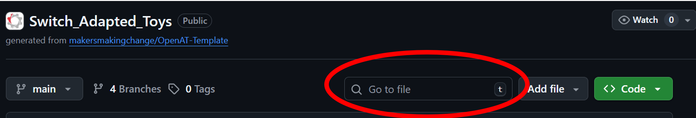
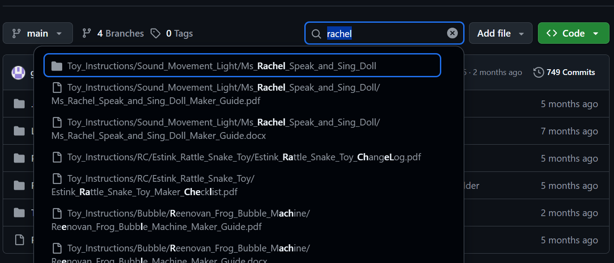

# Switch Adapted Toys
Welcome to the Maker's Making Change resources for Switch Adapted Toys.

This repository is a collection of guides, files, and tools to help individuals and organizations modify toys for use with assistive switches. These adaptations make play more inclusive for children and adults with limited mobility, giving them the power to activate toys with the press of a button—on their own terms.

## What You'll Find Here
 - How-To Guides: - Step-by-step instructions for adapting toys with simple tools and materials and an easy-to-use template for writing toy instructions
 - Educational Resources: Information on how to switch adapt a new toy
 - Equipment lists: Complete list of adapted toys and the tools and components needed to adapt them
 <!-- - Workshop Materials: Handouts and presentation slides for toy hackathons and build nights -->

<!--
## Who This Is For
 - Makers and volunteers interested in assistive technology
 - Therapists and educators supporting play-based learning
 - Families looking to adapt toys at home
 - Nonprofits and schools running toy adaptation workshops
-->

## How To Find a Toy
Toys have been organized by type into separate folders inside the "Toy_Instructions" folder. We have organized the toys this way to help make it easier to find a suitable substitution if you are unable to get the toy someone has requested directly.

You can search for a specific toy by typing in the search field on the repository.

The search is very broad, and does not rely on exact  matching between the files/folder you're looking for and what you type. For example, if you type "Rach", the search will find the Switch Adapted Ms. Rachel Speak and Sing Doll.

## Get Involved
This repository is open source and community-driven. Feel free to open issues, suggest improvements, or submit pull requests! Whether you're documenting your own process or translating guides into another language, your contributions help make inclusive play more accessible for everyone.

## License
All content is shared under the [Creative Commons Attribution-ShareAlike 4.0 License (CC BY-SA 4.0)](https://creativecommons.org/licenses/by-sa/4.0/), unless otherwise noted.

<!-- ABOUT MMC START -->
## About Makers Making Change

Makers Making Change is a program of [Neil Squire](https://www.neilsquire.ca/), a Canadian non-profit that uses technology, knowledge, and passion to empower people with disabilities.

Makers Making Change leverages the capacity of community based Makers, Disability Professionals and Volunteers to develop and deliver affordable Open Source Assistive Technologies.

 - Website: [www.MakersMakingChange.com](https://www.makersmakingchange.com/)
 - GitHub: [makersmakingchange](https://github.com/makersmakingchange)
 - Bluesky: [@makersmakingchange.bsky.social](https://bsky.app/profile/makersmakingchange.bsky.social)
 - Instagram: [@makersmakingchange](https://www.instagram.com/makersmakingchange)
 - Facebook: [makersmakechange](https://www.facebook.com/makersmakechange)
 - LinkedIn: [Neil Squire Society](https://www.linkedin.com/company/neil-squire-society/)
 - Thingiverse: [makersmakingchange](https://www.thingiverse.com/makersmakingchange/about)
 - Printables: [MakersMakingChange](https://www.printables.com/@MakersMakingChange)
