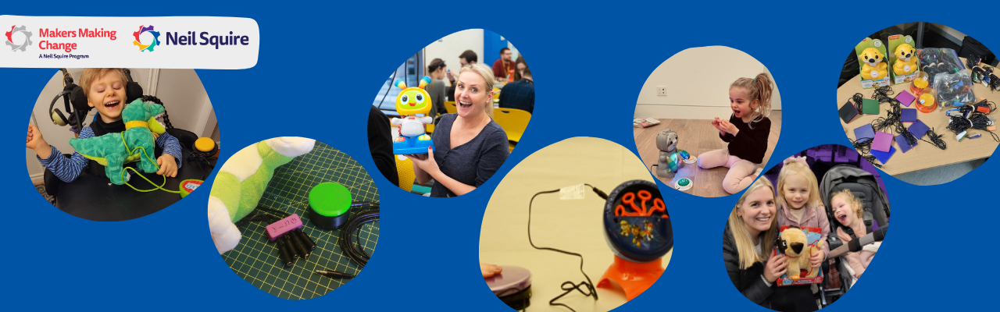

# Welcome to MMC's Toy Adapting Instructions

## What is this Resource? 
Welcome! This resource is a collection of the [Makers Making Change](https://www.makersmakingchange.com/), a program of [Neil Squire](https://www.neilsquire.ca/), toy adapting instructions and resources. Intended for makers and families to find step by step instructions to adapt toys to be assisitive switch accessible and host resources to make that process easier.

## Your Pathway to Play

There are two main sections of this web page:

    

        <h3>Toy Adapting Instructions</h3>
        
A variety of toys ranging in play styles (bubbles, light and sound, etc.) with step by step instructions on how to adapt them to be switch accessible.

        <ul>
            <li>Check out the <a href="toy-instructions">toy instructions here.</a></li>
        </ul>
    

    

        <h3>Toy Adapting Resources</h3>
        
Resources to help learn about toy adapting.

        <ul>
            <li>Check out the <a href="toy-resources">toy resources here.</a></li>
        </ul>
    

---

## Hacking For the Holidays

Lorem ipsum dolor sit amet, consectetur adipiscing elit. Cras vitae quam vitae purus dignissim egestas nec id orci. Sed ac iaculis lorem. In hac habitasse platea dictumst. Donec quis gravida odio. Nulla egestas turpis eget ligula sagittis semper. Maecenas placerat, elit ut aliquet vestibulum, velit neque viverra lacus, id euismod nisl dolor eget nulla. Fusce venenatis augue urna, in aliquet augue commodo nec. Sed congue augue non rutrum tristique. Nulla in quam lacinia, vehicula urna id, hendrerit libero. Etiam at maximus ex.

## Why Adaptive Toys Matter

Lorem ipsum dolor sit amet, consectetur adipiscing elit. Cras vitae quam vitae purus dignissim egestas nec id orci. Sed ac iaculis lorem. In hac habitasse platea dictumst. Donec quis gravida odio. Nulla egestas turpis eget ligula sagittis semper. Maecenas placerat, elit ut aliquet vestibulum, velit neque viverra lacus, id euismod nisl dolor eget nulla. Fusce venenatis augue urna, in aliquet augue commodo nec. Sed congue augue non rutrum tristique. Nulla in quam lacinia, vehicula urna id, hendrerit libero. Etiam at maximus ex.

