# Component & Tool List

This is a list of commonly used components and tools for switch adapting toys. Most components can be purchased from different manufacturers for various prices, and the tools listed are widely available at most local hardware stores but you can also use the link below to find our recommended links. Not every tool and component is needed for every toy. Please check the first page of a toy's Maker Guide to see what it specifically calls for.

  <a href="https://www.makersmakingchange.com/tools" class="btn btn-primary" target="_blank" rel="noopener">Click to Find Where to Purchase</a>

<!--
  IMAGE PLACEHOLDERS: every image below points to a filename under
  ../images/components/ that doesn't exist yet - drop matching files into
  docs/images/components/ with these exact names and they'll appear
  automatically. Until then, each one gracefully falls back to the site's
  existing placeholder image, so nothing breaks if some are still missing.

  Suggested source: the original PDF (Switch Adapted Toys Component and
  Tool List) has a product photo for most rows, plus a couple of
  "how it's used" photos (the two mono jack wiring shots, and the
  stripped-wire shot for the stereo cable) which map to the
  ".component-example" image slots below.
-->

## Components

### Mono Jack

  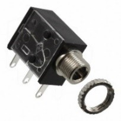
  

    
3.5 mm Rectangular Mono Jack

    
The most used mono jack. Solder wires onto the two tabs closest to the cable input.

    

      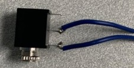
      Example: wires soldered onto the two tabs closest to the cable input
    

  

  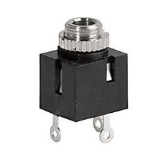
  

    
3.5 mm Square Mono Jack

    
Solder wires onto the two tabs directly across from each other.

    

      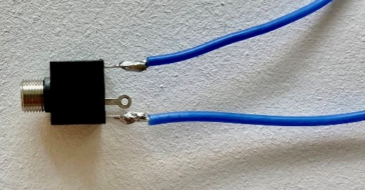
      Example: wires soldered onto the two tabs directly across from each other
    

  

  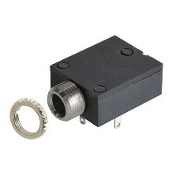
  

    
3.5 mm Mono Jack Flat Rectangular

    
3.5 mm Flat Mono Jack

  

### Cables

  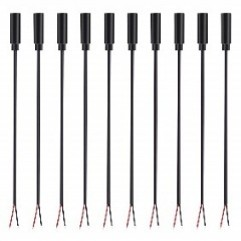
  

    
3.5 mm F/Bare Mono Cable (1 ft)

    ~$20.22 CAD / 10-pack
    
Standard mono cable, ready to use as-is.

  

  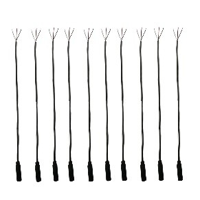
  

    
3.5 mm F/Bare Stereo Cable (1 ft)

    ~$10.99 CAD / 10-pack
    
To use as a mono cable: fully strip the insulation off the white wire, and 0.5 cm from the red and black wires. Wrap the exposed wire around the red cable.

    

      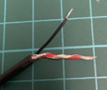
      Example: stripped and wrapped to use as a mono cable
    

  

### Battery Interrupter

  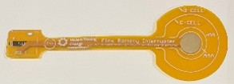
  

    
Flex PCB

    
Request directly from Makers Making Change.

  

### Additional Components

  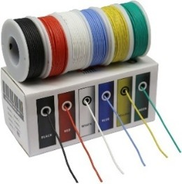
  

    
22 AWG Wire

    
Any 22 AWG silicone wire will work.

  

  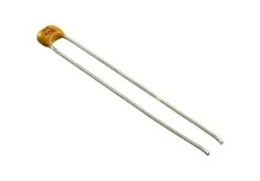
  

    
10,000 pf (103) Capacitor

    
Used for adapting multiple RC cars, including the Amazon Dinosaur RC Car, the Prextex RC Race and Police Car, and the Prextex RC Truck and Tractor.

  

  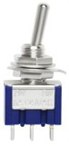
  

    
Toggle Switch

    ~$15.98 CAD / 10-pack
    
Used in the Nerf N-Strike Elite Hyperfire Blaster.

  

## Tools

  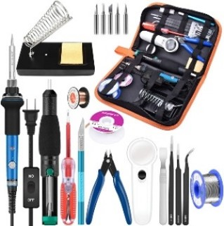
  

    
Soldering Kit

    ~$39.99 CAD
    
An easy and cheap way to acquire a lot of tools at once. Includes a soldering iron, solder, soldering iron stand, sponge, Phillips and flathead screwdrivers, flush cutter, tweezers, and more.

  

  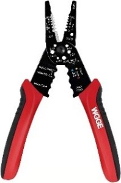
  

    
Wire Strippers

    ~$21.43 CAD
    
Required for mono jack / cable toys.

  

  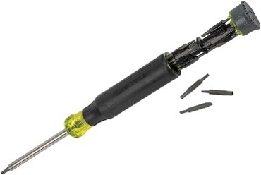
  

    
Multi Head Screwdriver

    ~$31.77 CAD
    
Comes with 26 bits. Helpful to have a few more screwdrivers than soldering irons on hand at events. Most toys use Phillips screwdrivers.

  

  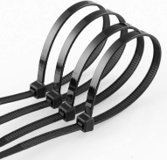
  

    
Cable Tie

    ~$10.99 CAD
    
Attach to the mono cable on the inside of the toy for strain relief. A pack of 150 typically includes 50 each of 10cm, 20cm, and 30cm ties.

  

  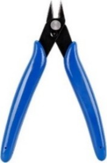
  

    
Flush Cutter

    
Used to cut wires. Already included in the soldering kit above.

  

  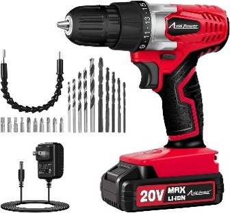
  

    
Drill and Drill Bits

    ~$69.99 CAD
    
Needed to create a hole in hardshell toys for a cable or jack. Use a 1/8" drill bit for a mono cable, and a 1/4" drill bit for a mono jack.

  

  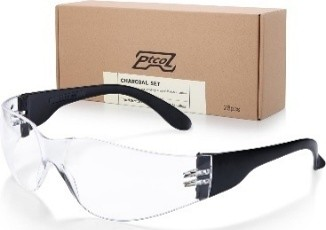
  

    
Safety Glasses

    ~$39.50 CAD / pack of 28
    
One pair per person is a good idea at events.

  

  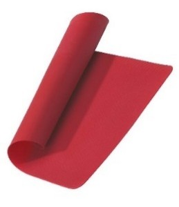
  

    
Silicone Mat

    ~$9.99 CAD (often on sale for $5)
    
Useful to have one with each soldering iron at events.

  

  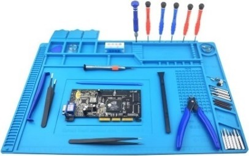
  

    
Silicone Mat (Personal Workstation)

    ~$25.99 CAD
    
A larger mat, good for a personal workstation.

  

  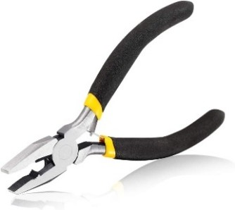
  

    
Pliers

    ~$11.99 CAD
  

  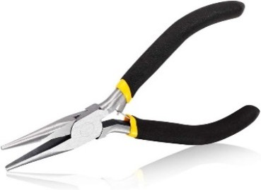
  

    
Long Nose Pliers

    ~$11.99 CAD
  

  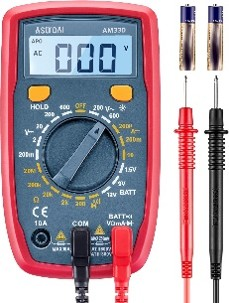
  

    
Multimeter

    ~$23.99 CAD
    
Useful for deciding where to solder new wires onto a PCB.

  

  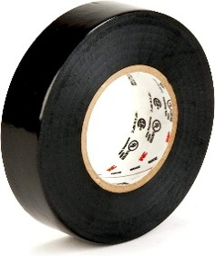
  

    
Electrical Tape

    ~$4.70 CAD
    
Often required for toys adapted with a mono jack.

  

  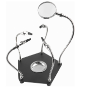
  

    
Helping Hands

    ~$29.99 CAD
    
Can be helpful when soldering.

  

  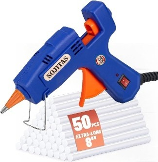
  

    
Hot Glue Gun

    ~$19.99 CAD
  

  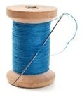
  

    
Needle and Thread

    
Sometimes needed to close plush toys back up.

  

---
